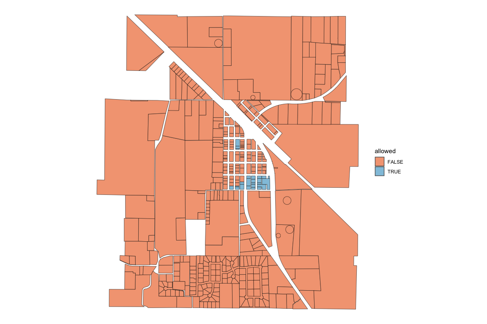
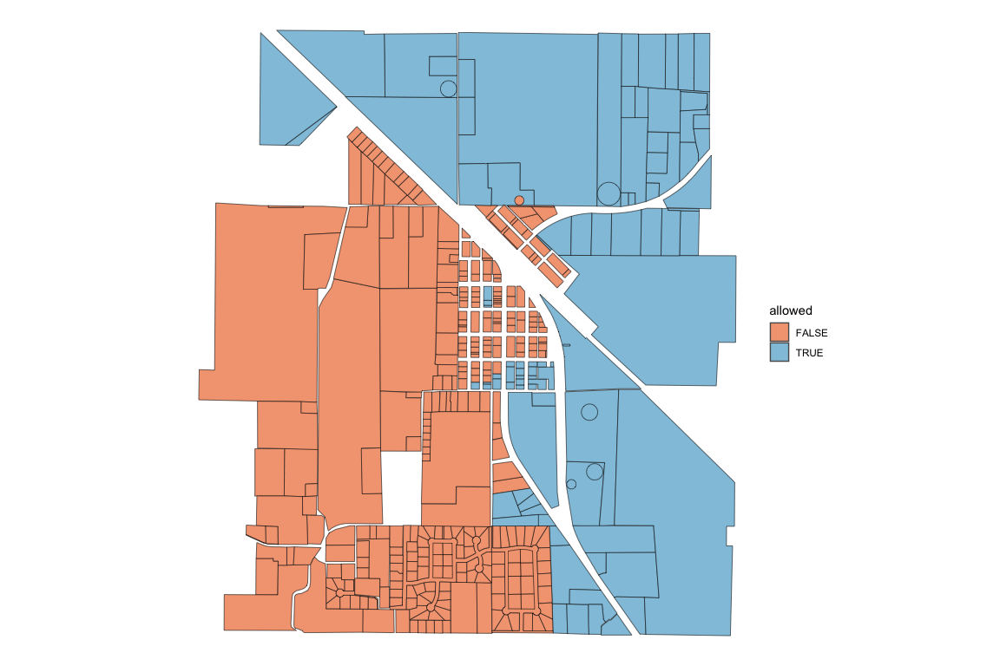
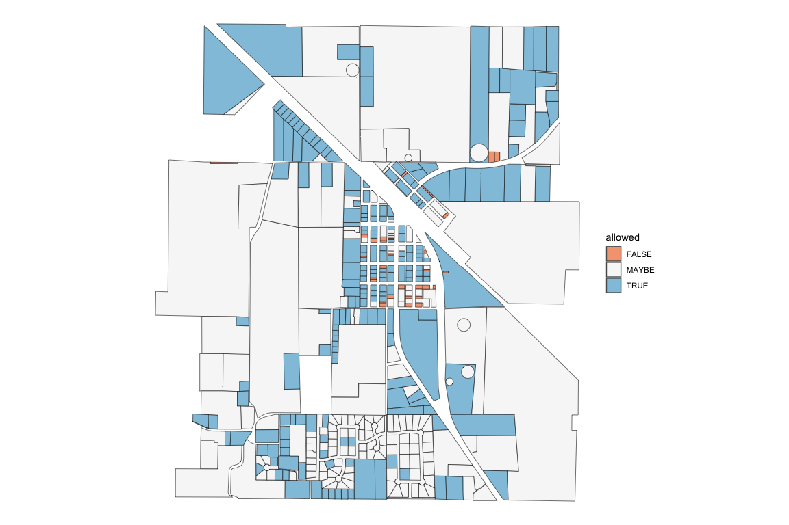

<!-- README.md is generated from README.Rmd. Please edit that file -->

# zoneR

<!-- badges: start -->

<!-- badges: end -->

Analyze the housing capacity of cities using Open Zoning Feed
Specification (OZFS) data.

The main function of zoneR is `zr_run_zoning_checks()` which reads in an
OZFS `.bldg`, `.parcel`, and `.zoning` file. It calculates the zoning
requirements for each parcel, checks them against the building
characteristics, and returns a data frame with a row for each parcel and
an “allowed” column containing one of three possible values.

- `TRUE`: The building is allowed on the parcel

- `FALSE`: The building is not allowed on the parcel

- `MAYBE`: The building might be allowed on the parcel depending on
  conditions that are not yet possible to express in OZFS.

## Installation

You can install the development version of zoneR from
[GitHub](https://github.com/) with:

``` r
# install.packages("devtools")
devtools::install_github("vibe-lab-gsd/zoneR")
```

## Example

This is a basic example of finding which parcels in Paradise, TX allow a
duplex with a gross floor area of 3200 square feet and a height of 45
feet. Small OZFS files accessible through the package will be used in
the example.

We get the file paths for the example OZFS files using
`zr_example_files()`.

``` r
library(zoneR)

bldg_path <- zr_example_files("2_fam.bldg")
parcel_path <- zr_example_files("Paradise.parcel")
zoning_path <- zr_example_files("Paradise.zoning")
```

We can then put each of the files into the `zr_run_zoning_checks()`
function and assign the result to a variable called zoning_checks.

``` r
zoning_checks <- zr_run_zoning_checks(bldg_file = bldg_path,
                                      parcel_files = parcel_path,
                                      zoning_files = zoning_path)
#> ___data_prep___(0.4 sec)
#> 
#> ___get_zoning_req___(0.9 sec)
#> 
#> ___initial_checks___(0.5 sec)
#> 21 parcels are TRUE or MAYBE
#> 
#> ___bldg_fit___(28.6 sec)
#> 9 parcels are TRUE or MAYBE
#> 
#> _____summary_____
#> total runtime: 30.3 sec (0.51 min)
#> 0 / 421 parcels allow the building
#> 11 / 421 parcels might allow the building
```

The result of the function is a simple features data frame with the
following columns: “parcel_id”, “allowed”, “reason”, “geometry.” Note
that the geometry is the centroid of the parcel.

``` r
head(zoning_checks)
#> Simple feature collection with 6 features and 3 fields
#> Geometry type: POINT
#> Dimension:     XY
#> Bounding box:  xmin: -97.69917 ymin: 33.1448 xmax: -97.69153 ymax: 33.15607
#> Geodetic CRS:  WGS 84
#>                           parcel_id allowed                         reason
#> 1     Wise_County_combined_parcel_1   FALSE               res_type, height
#> 2 Wise_County_combined_parcel_10300   FALSE               res_type, height
#> 3 Wise_County_combined_parcel_10450   FALSE               res_type, height
#> 4 Wise_County_combined_parcel_10451   FALSE res_type, height, unit_density
#> 5 Wise_County_combined_parcel_10452   FALSE res_type, height, unit_density
#> 6 Wise_County_combined_parcel_10464   FALSE               res_type, height
#>                     geometry
#> 1 POINT (-97.69524 33.14755)
#> 2 POINT (-97.69382 33.15607)
#> 3  POINT (-97.69415 33.1448)
#> 4 POINT (-97.69156 33.14562)
#> 5 POINT (-97.69153 33.14699)
#> 6 POINT (-97.69917 33.15142)
```

The graph below is a visualization of the results.


It appears this duplex would not be allowed in most the Paradise
parcels. To look further into the reasons, we can specify the checks we
want to be run and look at those results. Since land use regulations are
often a distinguishing factor in allowing a building on a parcel, only
the res_type check will be run in this next example. We will also put
`print_checkpoints = FALSE` because we don’t really need it to tell us
when it is done with the different parts of the function.

``` r
zoning_checks <- zr_run_zoning_checks(bldg_file = bldg_path,
                                      parcel_files = parcel_path,
                                      zoning_files = zoning_path, 
                                      checks = "res_type",
                                      print_checkpoints = FALSE)
#> zoning checks finished
#> total runtime: 1.3 sec (0.02 min)
```

Now we can see that only a few of the parcels are in a district that
allows buildings with two units. It makes sense why there were only a
few parcels in the previous check that might have allowed the building.


Here are a few other constraint checks to visualize.

Height Check

``` r
zoning_checks <- zr_run_zoning_checks(bldg_file = bldg_path,
                                      parcel_files = parcel_path,
                                      zoning_files = zoning_path, 
                                      checks = "height",
                                      print_checkpoints = FALSE)
#> zoning checks finished
#> total runtime: 1.4 sec (0.02 min)
```



Building Fit Check

``` r
zoning_checks <- zr_run_zoning_checks(bldg_file = bldg_path,
                                      parcel_files = parcel_path,
                                      zoning_files = zoning_path, 
                                      checks = "bldg_fit",
                                      print_checkpoints = FALSE)
#> zoning checks finished
#> total runtime: 96.8 sec (1.61 min)
```



Many of the “MAYBE” values attached to the bldg_fit constraint represent
parcels that didn’t have labeled sides. Without labeled sides, a proper
buildable area could not be calculated, and the building fit check was
skipped.

#### Detailed Check

In addition to the usual data frame that is returned, setting
`detailed_check = TRUE` returns the data frame with additional columns
for every check that took place (Note this requires more processing time
as the code does not skip consecutive checks if a previous check yields
FALSE).

``` r
zoning_checks <- zr_run_zoning_checks(bldg_file = bldg_path,
                                      parcel_files = parcel_path,
                                      zoning_files = zoning_path,
                                      detailed_check = TRUE)
#> ___data_prep___(0.2 sec)
#> 
#> ___get_zoning_req___(1 sec)
#> 
#> ___initial_checks___(0.5 sec)
#> 21 parcels are TRUE or MAYBE
#> 
#> ___bldg_fit___(1.57 min)
#> 221 parcels are TRUE or MAYBE
#> 
#> _____summary_____
#> total runtime: 96 sec (1.6 min)
#> 0 / 421 parcels allow the building
#> 11 / 421 parcels might allow the building
```

With these added columns, we can look more closely at why the building
does not fit in most of the parcels.

``` r
column_true_sums <- colSums(sf::st_drop_geometry(zoning_checks) == "TRUE", na.rm = TRUE)

ordered_sums <- column_true_sums[order(column_true_sums)]
```

| constraint_check | parcels_true |
|:-----------------|-------------:|
| res_type         |           24 |
| height           |           97 |
| bldg_fit         |          208 |
| parcel_side_lbl  |          254 |
| unit_density     |          297 |
| stories          |          397 |
| lot_cov_bldg     |          418 |
| district_check   |          421 |
| unit_size        |          421 |

It appears the res_type constraint is the most restrictive and the
unit_size constraint is the least restrictive for the given building.

## Inside the zr_run_zoning_checks()

Most of the functions in zoneR were created for
`zr_run_zoning_checks()`, but they can be use by themselves if desired.
Below are some of the main variables that the different zoneR functions
take in.

- **bldg_data:** The `.bldg` file read in as a list using
  `rjson::fromJSON()`

- **parcel_dims:** Created with the `zr_get_parcel_dims()` function. A
  simple features data frame with all the centroid and dimensional data
  from the `.parcel` file. It contains one row per parcel.

- **parcel_data:** One row of the parcel_dims data frame representing a
  unique parcel

- **parcel_geo:** Created with the `zr_get_parcel_geo()` function. A
  simple features data frame containing the geometry of each parcel side
  without the centroid or dimensional data.

- **zoning_data:** The data in the `.zoning` file read in as a simple
  features data frame using `sf::st_read()`.

- **district_data:** One row of the zoning_data data frame representing
  a unique district.
